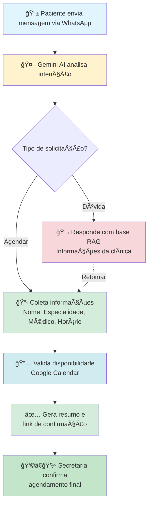

# 🤖 Chatbot Clínica Médica - Sistema Inteligente de Agendamento com Arquitetura Híbrida

<div align="center">


*Sistema de agendamento médico automatizado com IA conversacional*

[Funcionalidades](#-funcionalidades-principais) •
[Como Funciona](#-como-funciona) •
[Exemplos](#-exemplos-de-conversação) •
[Instalação](#-instalação-rápida) •
[Tecnologias](#-tecnologias-utilizadas)

</div>

---

## 📋 Sobre o Projeto

Sistema de chatbot inteligente desenvolvido em **Django REST Framework** que automatiza o pré-agendamento de consultas médicas através do **WhatsApp**. Utiliza **Google Gemini AI 2.0 Flash** para conversação natural, com integração completa ao **Google Calendar** para gerenciamento de horários em tempo real.

Desenvolvido como projeto de TCC, o sistema elimina a necessidade de atendimento telefônico para agendamentos, proporcionando uma experiência moderna e eficiente tanto para pacientes quanto para clínicas médicas.

### 🯠Principais Diferenciais

- 🤖 **Conversação Natural** - Gemini AI 2.0 Flash
- 📅 **Agendamento Inteligente** - Integração em tempo real com Google Calendar
- 📚 **Sistema RAG** - Base de conhecimento contextual da clínica
- 💾 **Persistência Completa** - Sessões e histórico de conversas
- 📊 **Monitoramento de Tokens** - Controle de custos da API Gemini
- 👥 **Handoff para Secretaria** - Transferência humanizada quando necessário
- â¸ï¸ **Sistema de Pausar/Retomar** - Tire dúvidas durante o agendamento sem perder o progresso

## 🬠Como Funciona

O chatbot atende pacientes via **WhatsApp**, guiando-os através de um processo conversacional natural para agendar consultas médicas. O fluxo é simples e intuitivo:



### 🔄 Fluxo de Agendamento

1. **Coleta de Dados**: Nome, especialidade, médico, data e horário
2. **Validação**: Verifica disponibilidade em tempo real no Google Calendar
3. **Confirmação**: Gera resumo e link para secretaria finalizar
4. **Flexibilidade**: Permite pausar para dúvidas e retomar automaticamente

---

## 💬 Exemplos de Conversação

### Exemplo 1: Agendamento Completo

```
👤 Usuário: Olá, quero agendar uma consulta

🤖 Bot: Olá! 😊 Sou a assistente virtual da Clínica PneumoSono.
       Para começar, preciso saber seu nome completo. Qual é seu nome?

👤 Usuário: João Silva Santos

🤖 Bot: Entendi. Confirma se seu nome completo é João Silva Santos?

👤 Usuário: Sim

🤖 Bot: Perfeito, João Silva Santos! Qual especialidade você deseja consultar?

👤 Usuário: Pneumologia

🤖 Bot: Perfeito! 🫠Pneumologia
       
       Médicos disponíveis:
       • Dr. Gustavo Magno (Medicina do Sono, Pneumologia)
       
       Com qual médico você gostaria de agendar?

👤 Usuário: Dr. Gustavo

🤖 Bot: Excelente escolha! 👨â€âš•ï¸
       Para qual data e horário você gostaria de agendar?

👤 Usuário: Segunda-feira às 14h

🤖 Bot: Para confirmar, o agendamento seria para 01/12/2025 às 14h 
       com Dr. Gustavo Magno, especialista em Pneumologia. Tudo certo?

👤 Usuário: Sim, está correto

🤖 Bot: ✅ Perfeito! Vamos confirmar seu pré-agendamento:
       
       📋 RESUMO:
       👤 Paciente: João Silva Santos
       👨â€âš•ï¸ Médico: Dr. Gustavo Magno
       📅 Data: 01/12/2025
       🕠Horário: 14:00
       
       📠Nossa secretária validará e confirmará seu agendamento.
       Clique no link: https://wa.me/55XXXXXXXXXXX?text=...
```

### Exemplo 2: Pausar para Dúvidas e Retomar Automaticamente

```
👤 Usuário: Quero agendar consulta

🤖 Bot: Para começar, preciso saber seu nome completo.

👤 Usuário: Maria Silva

🤖 Bot: Confirma se seu nome completo é Maria Silva?

👤 Usuário: Sim

🤖 Bot: Perfeito! Qual especialidade você deseja consultar?

👤 Usuário: Espera, quanto custa uma consulta?

🤖 Bot: O valor da consulta particular é R$ 150,00.
       
       Para qual especialidade você gostaria de agendar?

👤 Usuário: Vocês aceitam convênio?

🤖 Bot: Sim! Aceitamos:
       • Unimed
       • SulAmérica
       • Amil

👤 Usuário: Pneumologia  ↠Sistema retoma automaticamente!

🤖 Bot: Com a especialidade de Pneumologia escolhida, temos o 
       Dr. Gustavo Magno disponível. Com qual médico você prefere?

[... continua o agendamento ...]
```

### Exemplo 3: Apenas Tirar Dúvidas

```
👤 Usuário: Olá

🤖 Bot: Olá! 😊 Como posso ajudá-lo hoje?

👤 Usuário: Quais convênios vocês aceitam?

🤖 Bot: Aceitamos os seguintes convênios:
       • Unimed
       • SulAmérica
       • Amil

👤 Usuário: Qual o horário de funcionamento?

🤖 Bot: Nosso horário de funcionamento é de segunda a sexta, 
       das 8h às 18h.

👤 Usuário: Obrigada!

🤖 Bot: De nada! Estou à disposição quando precisar. 😊
```

---

## ğŸ—ï¸ Arquitetura do Sistema

### 📠Estrutura do Projeto

```
chatbot_ClinicaMedica/
├── api_gateway/                    # 🯠Gateway principal da API
│   ├── models.py                   # Modelos (sessões, mensagens)
│   ├── services/                   # Serviços de negócio
│   │   ├── gemini/                 # 🤖 Motor Gemini AI (modularizado)
│   │   │   ├── core_service.py           # Orquestrador principal
│   │   │   ├── intent_detector.py        # Detecção de intenções
│   │   │   ├── entity_extractor.py       # Extração de entidades
│   │   │   ├── response_generator.py     # Geração de respostas
│   │   │   └── session_manager.py        # Gerenciamento de sessões
│   │   ├── conversation_service.py # 💾 Persistência e estados
│   │   ├── rag_service.py          # 📚 Base de conhecimento
│   │   ├── whatsapp_service.py     # 💬 Integração WhatsApp
│   │   ├── google_calendar_service.py # 📅 Google Calendar
│   │   └── handoff_service.py      # 👥 Transferência humana
│   └── views.py                    # Webhooks e endpoints
├── rag_agent/                      # 🧠 Agente de conhecimento
│   └── models.py                   # ClinicaInfo, Medico, Especialidade, Exame
├── core/                           # âš™ï¸ Configurações Django
│   └── settings.py                 # Configurações (python-decouple)
├── requirements.txt                # 📦 Dependências Python
└── .env                           # 🔠Variáveis de ambiente (não commitar!)
```

### 🔧 Componentes Principais

| Componente | Descrição | Principais Funcionalidades |
|------------|-----------|---------------------------|
| **🤖 Gemini AI Service** | Motor de conversação com IA | • Detecção de intenções<br>• Extração de entidades<br>• Geração de respostas contextuais<br>• Gerenciamento de sessões |
| **💾 Conversation Service** | Persistência e estados | • Histórico de mensagens<br>• Gerenciamento de estados do fluxo<br>• Sistema pausar/retomar<br>• Validação de informações |
| **📚 RAG Service** | Base de conhecimento | • Informações da clínica<br>• Dados de médicos e especialidades<br>• Políticas de agendamento<br>• Exames disponíveis |
| **💬 WhatsApp Service** | Integração WhatsApp | • Recebimento de mensagens via webhook<br>• Envio de respostas<br>• Formatação de mensagens |
| **📅 Google Calendar Service** | Gerenciamento de agenda | • Consulta de disponibilidade<br>• Validação de horários<br>• Identificação inteligente de eventos<br>• Calendário único compartilhado |
| **👥 Handoff Service** | Transferência humana | • Geração de resumo<br>• Links de confirmação<br>• Notificação para secretaria |

## ✨ Funcionalidades Principais

### 🤖 Conversação Inteligente
- **Análise de Intenções**: Identifica automaticamente o que o usuário deseja (agendar, tirar dúvidas, etc.)
- **Extração de Entidades**: Captura nome, especialidade, médico, data e horário da conversa natural
- **Respostas Contextuais**: Mantém memória da conversa e responde de forma personalizada
- **Sistema Modular**: Arquitetura com 5 componentes especializados usando Gemini AI 2.0 Flash

### 📅 Agendamento Completo
- **Coleta Inteligente**: Guia o usuário passo a passo na coleta de informações
- **Validação em Tempo Real**: Consulta disponibilidade no Google Calendar instantaneamente
- **Confirmação Obrigatória**: Valida nome completo antes de finalizar
- **Pausar/Retomar**: Permite tirar dúvidas durante o agendamento sem perder o progresso
- **Retomada Automática**: Sistema detecta quando usuário volta a fornecer informações e continua automaticamente

### 💬 Integração WhatsApp
- **Webhooks**: Recebe e processa mensagens em tempo real
- **Respostas Automáticas**: Envia mensagens formatadas e profissionais
- **Multi-mídia**: Suporte a diferentes tipos de conteúdo

### 💾 Persistência de Dados
- **Sessões Persistentes**: Mantém contexto da conversa mesmo com interrupções
- **Histórico Completo**: Armazena todas as mensagens (usuário, bot, sistema)
- **Cache Inteligente**: Otimiza consultas ao banco de dados
- **Timeout de 24h**: Limpa sessões antigas automaticamente

### 📚 Base de Conhecimento (RAG)
- **Informações da Clínica**: Horários, localização, contatos
- **Catálogo de Médicos**: Especialidades, CRM, horários de atendimento
- **Políticas**: Agendamento, cancelamento, convênios aceitos
- **Exames**: Lista de exames disponíveis e preparos necessários

### 📊 Monitoramento
- **Controle de Custos**: Monitora consumo de tokens da API Gemini
- **Logs Estruturados**: Rastreamento completo de intenções e entidades
- **Métricas**: Estatísticas de uso e performance

### 🔄 Estados do Fluxo de Agendamento

O sistema utiliza uma máquina de estados para gerenciar o fluxo conversacional:

```
idle → collecting_patient_info → confirming_name → selecting_specialty 
  → selecting_doctor → choosing_schedule → confirming
```

**Estados Principais:**
- `idle` - Aguardando interação
- `collecting_patient_info` - Coletando nome
- `confirming_name` - Confirmando nome
- `selecting_specialty` - Escolhendo especialidade
- `selecting_doctor` - Escolhendo médico
- `choosing_schedule` - Selecionando data/horário
- `answering_questions` - Respondendo dúvidas (pausa agendamento)
- `confirming` - Confirmando agendamento final

**Validações Automáticas:**
- ✅ Nome deve ser confirmado explicitamente
- ✅ Médico deve ser selecionado antes de consultar disponibilidade
- ✅ Horário validado em tempo real no Google Calendar
- ✅ Correção automática de estados baseada em dados coletados

## ğŸ› ï¸ Tecnologias Utilizadas

| Categoria | Tecnologias |
|-----------|-------------|
| **Backend** | Django 5.2.6, Django REST Framework 3.16.1 |
| **Inteligência Artificial** | Google Gemini AI 2.0 Flash |
| **Integrações** | WhatsApp Business Cloud API, Google Calendar API |
| **Banco de Dados** | SQLite (desenvolvimento), PostgreSQL (produção recomendado) |
| **Configuração** | python-decouple (variáveis de ambiente) |
| **Autenticação** | Google Service Account |

**Principais Dependências:**
```txt
Django==5.2.6
djangorestframework==3.16.1
google-generativeai==0.8.3
google-api-python-client==2.181.0
google-auth==2.40.3
python-decouple==3.8
requests==2.32.5
```

## 📦 Instalação Rápida

### Pré-requisitos

- Python 3.8+ (recomendado: 3.10+)
- Conta Google Cloud Platform (Gemini AI + Calendar API)
- WhatsApp Business Account (Meta Business)
- Ngrok (para testes locais com webhooks)

### Passo 1: Clonar e Configurar Ambiente

```bash
# Clone o repositório
git clone https://github.com/seu-usuario/chatbot_ClinicaMedica.git
cd chatbot_ClinicaMedica

# Crie e ative ambiente virtual
python -m venv venv
source venv/bin/activate  # Linux/Mac
venv\Scripts\activate     # Windows

# Instale dependências
pip install -r requirements.txt
```

### Passo 2: Configurar Variáveis de Ambiente

Crie um arquivo `.env` na raiz do projeto:

```bash
# âš™ï¸ Django
SECRET_KEY=sua_secret_key_aqui
DEBUG=True

# 🤖 Google Gemini AI
GEMINI_API_KEY=sua_gemini_api_key_aqui

# 💬 WhatsApp Business API
WHATSAPP_ACCESS_TOKEN=seu_whatsapp_token
WHATSAPP_PHONE_NUMBER_ID=seu_phone_id
WHATSAPP_VERIFY_TOKEN=seu_verify_token

# 📅 Google Calendar
GOOGLE_CALENDAR_ENABLED=True
GOOGLE_SERVICE_ACCOUNT_FILE=service-account-key.json
CLINIC_CALENDAR_ID=seu_calendar_id@group.calendar.google.com

# 🥠Clínica
CLINIC_WHATSAPP_NUMBER=5500000000000
CLINIC_DOMAIN=gmail.com
```

### 🔑 Como obter as credenciais:

| Variável | Como Obter |
|----------|------------|
| `GEMINI_API_KEY` | 1. Acesse [Google AI Studio](https://aistudio.google.com/app/apikey)<br>2. Faça login e clique em "Create API Key" |
| `WHATSAPP_ACCESS_TOKEN` | Configure em [Meta for Developers](https://developers.facebook.com/) |
| `GOOGLE_SERVICE_ACCOUNT_FILE` | 1. Crie Service Account no [Google Cloud Console](https://console.cloud.google.com/)<br>2. Baixe JSON de credenciais<br>3. Renomeie para `service-account-key.json` |
| `CLINIC_CALENDAR_ID` | Vá em Configurações do Google Calendar > ID do Calendário |

### Passo 3: Configurar Banco de Dados

```bash
# Execute migrações
python manage.py migrate

# Crie superusuário para acessar /admin
python manage.py createsuperuser
```

### Passo 4: Configurar Google Calendar

1. Compartilhe o calendário da clínica com o email da Service Account
2. Dê permissão de "Fazer alterações nos eventos"
3. O sistema identifica automaticamente eventos por médico no título

**Formato de eventos no calendário:**
- "Dr. João - Consulta" ✅
- "Consulta - Dr. Pedro Magno" ✅
- "Pneumologia - João Silva" ✅

### Passo 5: Testar Localmente

```bash
# Inicie o servidor Django
python manage.py runserver

# Em outro terminal, inicie o ngrok
ngrok http 8000

# Configure o webhook do WhatsApp com a URL do ngrok:
# https://SEU-NGROK-URL.ngrok-free.app/api/whatsapp/webhook/
```

**✅ Pronto!** Envie uma mensagem no WhatsApp e teste o chatbot.

---

## 💾 Modelos de Dados

### ConversationSession
Armazena sessões de conversa com estado persistente.

**Campos principais:**
- `phone_number` - Identificador único do paciente
- `patient_name` - Nome confirmado
- `current_state` - Estado atual do fluxo
- `selected_specialty` - Especialidade escolhida
- `selected_doctor` - Médico selecionado
- `preferred_date` / `preferred_time` - Data e horário

### ConversationMessage
Registra histórico completo de mensagens.

**Campos principais:**
- `message_type` - user, bot ou system
- `content` - Conteúdo da mensagem
- `intent` - Intenção identificada
- `entities` - Entidades extraídas (JSON)

### Base de Conhecimento (RAG)
- **ClinicaInfo** - Informações da clínica
- **Medico** - Cadastro de médicos
- **Especialidade** - Especialidades oferecidas
- **Exame** - Exames disponíveis

---

## 📊 Monitoramento

O sistema possui logs estruturados para monitoramento:

- **Conversation Logger** - Logs de conversação e fluxo
- **Gemini Logger** - Logs do processamento de IA
- **WhatsApp Logger** - Logs de integração WhatsApp
- **Calendar Logger** - Logs do Google Calendar
- **Token Monitor** - Controle de custos da API Gemini

---

## 🔌 API Endpoints

| Endpoint | Método | Descrição |
|----------|--------|-----------|
| `/api/whatsapp/webhook/` | GET | Verificação do webhook WhatsApp |
| `/api/whatsapp/webhook/` | POST | Recebimento de mensagens |
| `/admin/` | GET | Interface administrativa Django |

---

## 🚀 Roadmap e Próximos Passos

### Curto Prazo
- [ ] Dashboard web para secretaria visualizar agendamentos
- [ ] Sistema de notificações (email/SMS de confirmação)
- [ ] Reagendamento e cancelamento via chatbot
- [ ] Análise de sentimento para priorizar casos urgentes

### Médio Prazo
- [ ] Cache Redis para melhor performance
- [ ] Migração para PostgreSQL em produção
- [ ] Containerização com Docker
- [ ] CI/CD com GitHub Actions
- [ ] Fine-tuning do Gemini para contexto médico

### Longo Prazo
- [ ] Integração com CRM médico e prontuário eletrônico
- [ ] Sistema de pagamentos online
- [ ] Telemedicina integrada
- [ ] Análise preditiva de demanda
- [ ] Multi-idioma (Inglês, Espanhol)
- [ ] Compliance LGPD/HIPAA completo

## 🤠Como Contribuir

Contribuições são bem-vindas! Para contribuir:

1. Faça um fork do projeto
2. Crie uma branch para sua feature (`git checkout -b feature/nova-funcionalidade`)
3. Commit suas mudanças (`git commit -m 'feat: adiciona nova funcionalidade'`)
4. Push para a branch (`git push origin feature/nova-funcionalidade`)
5. Abra um Pull Request

**Padrões de Commit:** Seguimos [Conventional Commits](https://www.conventionalcommits.org/)
- `feat:` Nova funcionalidade
- `fix:` Correção de bug
- `docs:` Documentação
- `refactor:` Refatoração
- `test:` Testes

---

## 🯠Comandos Úteis

```bash
# Iniciar servidor
python manage.py runserver

# Testar com ngrok
ngrok http 8000

# Executar migrações
python manage.py migrate

# Criar superusuário
python manage.py createsuperuser
```

---

## â“ Perguntas Frequentes

<details>
<summary><b>Como obtenho a chave API do Gemini?</b></summary>

1. Acesse [Google AI Studio](https://aistudio.google.com/app/apikey)
2. Faça login e clique em "Create API Key"
3. Copie e cole no arquivo `.env`
</details>

<details>
<summary><b>O calendário precisa ser separado por médico?</b></summary>

Não! O sistema usa um único calendário compartilhado e identifica automaticamente os eventos de cada médico pelo título (ex: "Dr. João - Consulta").
</details>

<details>
<summary><b>Como testo o chatbot localmente?</b></summary>

1. Inicie o servidor: `python manage.py runserver`
2. Inicie o ngrok: `ngrok http 8000`
3. Configure o webhook do WhatsApp com a URL do ngrok
4. Envie uma mensagem no WhatsApp
</details>

<details>
<summary><b>Como faço deploy em produção?</b></summary>

Checklist básico:
- Configure variáveis de ambiente no servidor
- Use PostgreSQL ao invés de SQLite
- Defina `DEBUG=False`
- Configure `ALLOWED_HOSTS`
- Use HTTPS
- Configure backup automático
</details>

---

## 📊 Status do Projeto


**Projeto desenvolvido como TCC (Trabalho de Conclusão de Curso)**

---

## 🆠Principais Destaques

- 🤖 IA Conversacional com Gemini 2.0 Flash
- 📅 Agendamento em tempo real com Google Calendar
- 💬 Integração completa com WhatsApp Business
- 📚 Sistema RAG para base de conhecimento
- â¸ï¸ Sistema pausar/retomar durante dúvidas
- 💾 Persistência completa de sessões
- 📊 Monitoramento de custos de IA


---

## 👨â€ğŸ’» Autor

**Gabriel Ramos**

- LinkedIn: [Gabriela Zerbone](https://www.linkedin.com/in/gabrielazerbone/)
- GitHub: [@gzerbone](https://github.com/gzerbone)
- Email: gzerbonemb@gmail.com

---

<div align="center">

**⭠Se este projeto foi útil, considere dar uma estrela!**

**Desenvolvido com â¤ï¸ para revolucionar o atendimento em clínicas médicas**

</div>
