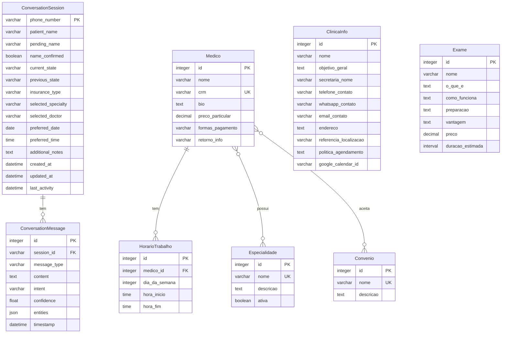

# 📊 Diagrama ER - Formato para Ferramentas Visuais

Este arquivo contém o diagrama entidade-relacionamento em formatos compatíveis com ferramentas de criação de diagramas visuais, facilitando a criação de figuras profissionais para o TCC.

---

## 🎨 Formato dbdiagram.io

Copie e cole o código abaixo em https://dbdiagram.io para gerar o diagrama visual automaticamente:

```dbml
// Diagrama ER - Sistema de Chatbot Clínica Médica
// App: api_gateway

Table ConversationSession {
  phone_number varchar(20) [pk, unique, note: 'Número do telefone do paciente (identificador único)']
  patient_name varchar(100) [note: 'Nome completo confirmado do paciente']
  pending_name varchar(100) [note: 'Nome extraído aguardando confirmação']
  name_confirmed boolean [default: false, note: 'Flag indicando se o nome foi confirmado']
  current_state varchar(50) [default: 'idle', note: 'Estado atual: idle, collecting_patient_info, confirming_name, selecting_specialty, selecting_doctor, choosing_schedule, answering_questions, confirming']
  previous_state varchar(50) [note: 'Estado anterior (sistema pausar/retomar)']
  insurance_type varchar(50) [note: 'Tipo de convênio ou Particular']
  selected_specialty varchar(100) [note: 'Especialidade médica selecionada']
  selected_doctor varchar(100) [note: 'Médico selecionado pelo paciente']
  preferred_date date [note: 'Data preferida para consulta']
  preferred_time time [note: 'Horário preferido para consulta']
  additional_notes text [note: 'Observações adicionais sobre o agendamento']
  created_at datetime [default: `now()`, note: 'Data/hora de criação da sessão']
  updated_at datetime [default: `now()`, note: 'Data/hora da última atualização']
  last_activity datetime [default: `now()`, note: 'Data/hora da última atividade']
  
  Note: 'Sessão de conversa persistente para fluxos de agendamento'
}

Table ConversationMessage {
  id integer [pk, increment, note: 'Identificador único da mensagem']
  session_id varchar(20) [ref: > ConversationSession.phone_number, note: 'Sessão à qual a mensagem pertence']
  message_type varchar(10) [note: 'Tipo: user, bot, system']
  content text [note: 'Conteúdo completo da mensagem']
  intent varchar(50) [note: 'Intenção identificada pelo Gemini AI']
  confidence float [note: 'Confiança da análise (0.0 a 1.0)']
  entities json [default: '{}', note: 'Entidades extraídas: nome_paciente, especialidade, medico, data, horario']
  timestamp datetime [default: `now()`, note: 'Data/hora da mensagem']
  
  Note: 'Mensagens individuais da conversa'
}

// App: rag_agent

Table ClinicaInfo {
  id integer [pk, increment]
  nome varchar(100) [default: 'Clínica PneumoSono', note: 'Nome da clínica']
  objetivo_geral text [note: 'Objetivo e missão da clínica']
  secretaria_nome varchar(100) [default: 'Raro', note: 'Nome da secretária/recepcionista']
  telefone_contato varchar(20) [note: 'Telefone fixo de contato']
  whatsapp_contato varchar(20) [note: 'Número do WhatsApp da clínica']
  email_contato varchar(255) [note: 'E-mail de contato']
  endereco text [note: 'Endereço completo da clínica']
  referencia_localizacao varchar(200) [note: 'Referência para facilitar localização']
  politica_agendamento text [note: 'Política de agendamento e horários']
  google_calendar_id varchar(255) [note: 'ID da agenda principal do Google Calendar']
  
  Note: 'Informações gerais da clínica (Singleton - apenas 1 registro)'
}

Table Especialidade {
  id integer [pk, increment]
  nome varchar(100) [unique, note: 'Nome da especialidade (ex: Cardiologia, Pneumologia)']
  descricao text [note: 'Descrição detalhada da especialidade']
  ativa boolean [default: true, note: 'Se a especialidade está ativa para seleção']
  
  Note: 'Especialidades médicas oferecidas pela clínica'
}

Table Medico {
  id integer [pk, increment]
  nome varchar(100) [note: 'Nome completo do médico']
  crm varchar(100) [unique, note: 'Número do CRM (Conselho Regional de Medicina)']
  bio text [note: 'Biografia e informações profissionais do médico']
  preco_particular decimal(8,2) [note: 'Preço da consulta particular']
  formas_pagamento varchar(200) [note: 'Formas de pagamento aceitas']
  retorno_info varchar(100) [default: 'Consulta de retorno em até 30 dias incluído no valor.', note: 'Informações sobre consulta de retorno']
  
  Note: 'Médicos que atendem na clínica'
}

Table MedicoEspecialidade {
  medico_id integer [ref: > Medico.id]
  especialidade_id integer [ref: > Especialidade.id]
  
  Note: 'Tabela intermediária para relacionamento N:M entre Medico e Especialidade'
}

Table Convenio {
  id integer [pk, increment]
  nome varchar(100) [unique, note: 'Nome do convênio (ex: Unimed, Bradesco Saúde)']
  descricao text [note: 'Descrição e informações do convênio']
  
  Note: 'Convênios médicos aceitos pela clínica'
}

Table MedicoConvenio {
  medico_id integer [ref: > Medico.id]
  convenio_id integer [ref: > Convenio.id]
  
  Note: 'Tabela intermediária para relacionamento N:M entre Medico e Convenio'
}

Table HorarioTrabalho {
  id integer [pk, increment]
  medico_id integer [ref: > Medico.id, note: 'Médico ao qual o horário pertence']
  dia_da_semana integer [note: '1=Segunda, 2=Terça, 3=Quarta, 4=Quinta, 5=Sexta, 6=Sábado, 7=Domingo']
  hora_inicio time [note: 'Hora de início do atendimento']
  hora_fim time [note: 'Hora de término do atendimento']
  
  Note: 'Horários de atendimento de cada médico por dia da semana'
  indexes {
    (medico_id, dia_da_semana, hora_inicio) [unique, name: 'unique_medico_horario']
  }
}

Table Exame {
  id integer [pk, increment]
  nome varchar(100) [note: 'Nome do exame (ex: Polissonografia)']
  o_que_e text [note: 'Descrição do que é o exame']
  como_funciona text [note: 'Como o exame funciona']
  preparacao text [note: 'Preparação necessária para o exame']
  vantagem text [note: 'Vantagens do exame']
  preco decimal(8,2) [note: 'Preço do exame']
  duracao_estimada interval [note: 'Duração estimada (ex: 00:30:00 para 30 minutos)']
  
  Note: 'Exames e procedimentos oferecidos pela clínica'
}
```

---

## 📐 Formato Mermaid (para GitHub, Notion, etc.)



---

## 🎯 Instruções de Uso

### Para dbdiagram.io:
1. Acesse https://dbdiagram.io
2. Clique em "Create New Diagram"
3. Cole o código DBML fornecido acima
4. O diagrama será gerado automaticamente
5. Use o botão "Export" para salvar como PNG, PDF ou SVG

### Para Mermaid:
1. Use em editores que suportam Mermaid (GitHub, Notion, Obsidian, etc.)
2. Ou use o editor online: https://mermaid.live
3. Cole o código Mermaid fornecido acima
4. Exporte como PNG ou SVG

### Para draw.io / diagrams.net:
1. Acesse https://app.diagrams.net
2. Crie um novo diagrama
3. Use as entidades e relacionamentos descritos no diagrama detalhado
4. Organize visualmente seguindo o layout sugerido

### Para MySQL Workbench:
1. Abra o MySQL Workbench
2. Vá em Database > Reverse Engineer
3. Ou crie manualmente usando o modelo ER
4. Use as informações do diagrama detalhado

---

## 📋 Checklist para Figura no TCC

Ao criar a figura do diagrama ER para o TCC, certifique-se de incluir:

- ✅ Todas as 8 entidades principais
- ✅ Todos os relacionamentos (1:N e N:M)
- ✅ Chaves primárias (PK) claramente marcadas
- ✅ Chaves estrangeiras (FK) claramente marcadas
- ✅ Cardinalidades (1, N, M) indicadas
- ✅ Legenda explicativa
- ✅ Separação visual entre os dois apps (api_gateway e rag_agent)
- ✅ Nomes das entidades em português
- ✅ Tipos de dados principais (opcional, mas recomendado)
- ✅ Constraints importantes (UNIQUE, NOT NULL)

---

## 🎨 Sugestões de Cores

Para melhor visualização, sugere-se usar cores diferentes:

- **api_gateway** (ConversationSession, ConversationMessage): Azul
- **rag_agent - Informações** (ClinicaInfo): Verde
- **rag_agent - Médicos** (Medico, Especialidade, HorarioTrabalho): Laranja
- **rag_agent - Convênios** (Convenio): Roxo
- **rag_agent - Exames** (Exame): Vermelho

---

**Última Atualização:** Novembro 10, 2025  
**Versão:** 1.0  
**Status:** ✅ Formatos prontos para uso em ferramentas visuais

